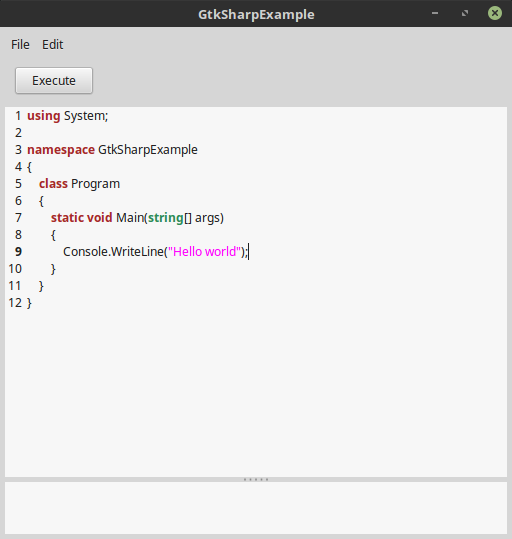
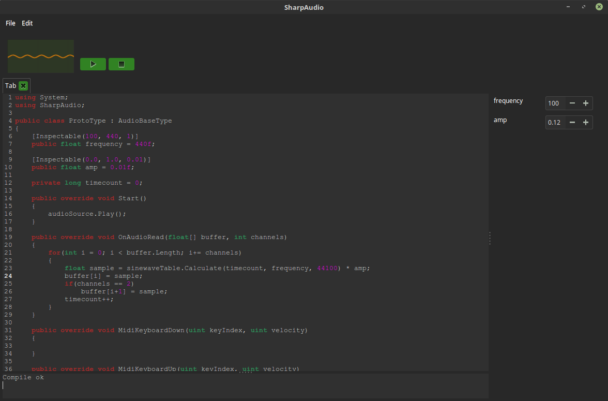
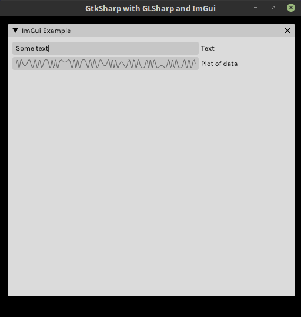

# GtkSharp
An object oriented GTK 3 wrapper for dotnetcore.

# Dependencies
- libgtk-3-dev
- libgtksourceview-3.0-dev
- libglib2.0-dev
- libgdk-pixbuf2.0-dev
- libcairo2-dev
- libpango1.0-dev
- libatk1.0-dev

# Disclaimer
Please take note that this is a work in progress. I'll try to make it as complete as possible overtime, but for now it's just a proof of concept.

# Example



```csharp
using System;
using System.IO;
using System.Collections.Generic;
using GtkSharp.Gtk.Types;
using GtkSharp.Gtk.Widgets;

namespace GtkSharpApplication
{
    class Program
    {
        static void Main(string[] args)
        {
            Application application = new Application("GtkSharpApplication", 512, 512);
            application.Run(args);
        }
    }

    public class Application : ApplicationBase
    {
        private Box box;
        private MenuBar menuBar;
        private Fixed fixedPanel;
        private Paned paned;
        private Button buttonExecute;
        private ScrolledWindow scrolledSource;
        private ScrolledWindow scrolledLog;
        private SourceView sourceView;
        private TextView textViewLog;

        public Application() : base()
        {
            
        }

        public Application(string title, int width, int height) : base(title, width, height)
        {
            
        }

        public override void Initialize()
        {
            box = new Box(GtkOrientation.Vertical, 0);
            menuBar = new MenuBar();
            fixedPanel = new Fixed();
            paned = new Paned(GtkOrientation.Vertical);
            scrolledSource = new ScrolledWindow(GtkPolicyType.Automatic, GtkPolicyType.Automatic);
            scrolledLog = new ScrolledWindow(GtkPolicyType.Automatic, GtkPolicyType.Automatic);
            buttonExecute = new Button();
            sourceView = new SourceView("c-sharp");
            textViewLog = new TextView();

            box.SetMargins(5, 5, 5, 5);
            sourceView.LineNumbers = true;
            buttonExecute.Text = "Execute";
            buttonExecute.Clicked += Execute;

            window.Add(box);
            box.Add(menuBar, false, false, 0);
            box.Add(fixedPanel, false, false, 0);
            fixedPanel.Add(buttonExecute, 10, 10);
            box.Add(paned, true, true, 0);
            paned.Add(scrolledSource, 0, false, false);
            paned.Add(scrolledLog, 1, false, false);
            
            scrolledSource.Add(sourceView);
            scrolledLog.Add(textViewLog);

            textViewLog.ReadOnly = true;

            List<MenuItem> menuFile = new List<MenuItem>();
            MenuItem menuItemFileOpen = new MenuItem("Open");
            MenuItem menuItemFileSave = new MenuItem("Save");
            MenuItem menuItemFileExit = new MenuItem("Exit");
            menuItemFileOpen.Activate += OnMenuItemOpenClicked;
            menuItemFileSave.Activate += OnMenuItemSaveClicked;
            menuItemFileExit.Activate += OnMenuItemExitClicked;
            menuFile.Add(menuItemFileOpen);
            menuFile.Add(menuItemFileSave);
            menuFile.Add(menuItemFileExit);

            List<MenuItem> menuEdit = new List<MenuItem>();
            MenuItem menuItemEditClearLog = new MenuItem("Clear Log");
            menuItemEditClearLog.Activate += OnMenuItemClearLogClicked;
            menuEdit.Add(menuItemEditClearLog);

            menuBar.AddMenu("File", menuFile);
            menuBar.AddMenu("Edit", menuEdit);
        }

        private void Execute()
        {
            textViewLog.Text = sourceView.Text;
        }

        private void OnMenuItemOpenClicked()
        {
            OpenFileDialog dialog = new OpenFileDialog(window);

            if(dialog.ShowDialog() == GtkResponseType.Accept)
            {
                if(File.Exists(dialog.FileName))
                {
                    string text = File.ReadAllText(dialog.FileName);
                    sourceView.Text = text;
                }
            }
        }

        private void OnMenuItemSaveClicked()
        {
            string text = sourceView.Text;

            if(text.Length == 0)
            {
                textViewLog.Text = "Nothing to save...";
                return;
            }

            SaveFileDialog dialog = new SaveFileDialog(window);

            if(dialog.ShowDialog() == GtkResponseType.Accept)
            {
                string filename = dialog.FileName;
                if(!filename.EndsWith(".cs"))
                {
                    filename += ".cs";
                }

                File.WriteAllText(filename, text);
                textViewLog.Text = "File saved as " + filename;
            }
        }        

        private void OnMenuItemExitClicked()
        {
            Quit();
        }

        private void OnMenuItemClearLogClicked()
        {
            textViewLog.Clear();
        }
    }
}
```

# Applications made with GtkSharp




